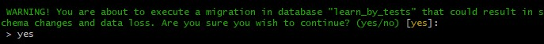
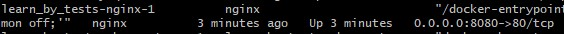

# Gym
This project is the MVP version. I've created this application to track my progress at the gym, it allows:
* create exercises
* create stations
* add exercises to stations
* create training
* track training progress

The application can be found at https://gym.vxm.pl, but I do not activate a new user account because I have not
implemented data separation per user.

The applications can be tested in the development environment, I also added sample data there.

## Local environment requirements
Console, docker, docker-compose, make, internet.

## How to launch on the local environment
1. navigate to project dir in console and execute `make start`
2. answer `yes` on migration prompt 
3. when console is ready execute `docker-compose ps` and locate port near nginx container e.g `8080` 
4. navigate to localhost with found port e.g `localhost:8080` and login with `example@test.com` and `Pass123@`